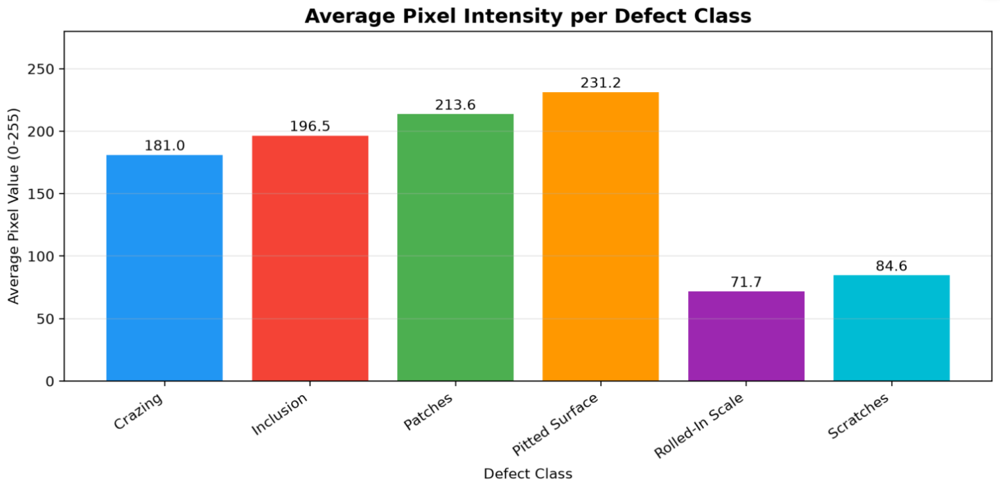

# Steel Surface Defect Dataset Explorer

The NEU Steel Surface Defect Dataset contains 1,800 grayscale images of real steel surface defects captured from a hot-rolling production line. This dashboard makes the dataset interactively explorable — showing class distribution, sample images, pixel intensity patterns, and defect severity — without needing to download anything.

Built as a companion to the [Steel Surface Defect Detector](https://github.com/KaziZaber/steel-defect-detector) — the dataset explorer shows the data behind the model.

## Live Demo

[📊 Explore the Dataset](https://steel-defect-eda.streamlit.app/)

## What This Dashboard Shows

No need to upload anything, just for exploring. The dashboard walks through the dataset visually: how many images per class, what each defect looks like, how bright or dark each defect type is on average, and what causes each defect in the rolling process.

## Dataset

NEU Steel Surface Defect Dataset — 1,800 images across 6 classes: Crazing, Inclusion, Patches, Pitted Surface, Rolled-in Scale, Scratches

Pre-split 80/20 — 240 training and 60 validation images per class. Perfectly balanced — no class weighting needed during model training.

## Why This Dashboard Exists

Understanding data before modeling it is fundamental to good machine learning practice. The pixel intensity analysis showed pitted surface as the brightest defect class on average and rolled-in scale and scratches as the darkest — distinct enough visual signatures across classes to suggest pixel brightness alone contributes meaningfully to class separability, even before spatial features come into play. The class balance confirmed no resampling was needed. These findings directly informed the modeling decisions in the main project.

## Related Project

🔬 [Steel Surface Defect Detector App](https://steel-defect-detector-r2krsf2m5fvscfmzpetxa5.streamlit.app) — ResNet18 transfer learning model achieving 95.8% validation accuracy, built using this dataset

## Tech Stack

Python | Streamlit | Matplotlib | NumPy | Pillow

## Status

Complete — deployed June 2026
